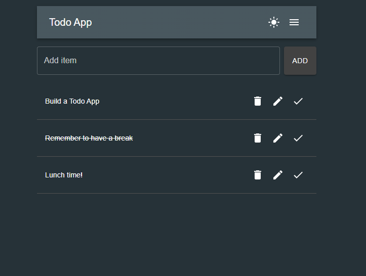

# Todo App

This is a ongoing project! A simple Todo App built following TDD principles using [Express](https://expressjs.com/), [TypeScript](https://www.typescriptlang.org/), and [Material UI](https://mui.com/material-ui/). You can check the progress in Vercel: https://todo-app-seven-omega-40.vercel.app/

---

## Table of Contents

- [Project Purpose](#project-purpose)
- [Current Status](#current-status)
- [Technologies Used](#technologies-used)
- [Testing](#testing)
- [CI/CD & Code Quality](#cicd--code-quality)
- [Planned Features](#planned-features)

---

## Project Purpose

This app is being built to:

- Practice Test-Driven Development (TDD)
- Build a RESTful API with Express and TypeScript
- Develop a frontend using Vite + TypeScript + Material UI
- Learn proper error handling and validation patterns
- Publish the app using a production platform (Vercel)
- Learn the basics of setting up a CI/CD pipeline with Git hooks and automated deployment

---

## Current Status

### Current version looks like this

### Frontend (in progress)

- Initialized with [Vite](https://vitejs.dev/) + [TypeScript](https://www.typescriptlang.org/)
- UI components built with [Material UI](https://mui.com/)
- Functionalities added:
  - Add, Edit, Delete, and **Mark todos as completed / not completed**
    - Displaying todos in a list format **with visual indication for completed todos (text is struck through)**
  - Displaying todos in a list format
  - Success and error notifications shown via `Snackbar`
  - Dialogs for confirmation and editing using MUI `Dialog`
  - AppBar header with title and dropdown menu (Material UI)
    - Menu includes actions: _Delete all todos_ and _Close menu_
    - Added dark mode support
- Tests written with [Vitest](https://vitest.dev/) and [Testing Library](https://testing-library.com/)
  - Unit tests for individual components
  - Integration tests for ensuring proper interaction between components
  - End-to-End tests using [Playwright](https://playwright.dev/)
- Security improvements:
  - CORS configured to allow only one frontend origin
  - [helmet](https://helmetjs.github.io/) used for securing HTTP headers

### Backend

- Basic CRUD operations implemented (GET, ADD, DELETE, PUT)
- **NEW**: Added functionality to **toggle the completed state** of a todo
- Basic error handling (400, 404, 409)
- Unique ID generation with [`uuid`](https://www.npmjs.com/package/uuid)
- Delete /todos endpoint added for bulk deletion for all todos

---

## Technologies Used

### Frontend:

- [Vite](https://vitejs.dev/)
- [TypeScript](https://www.typescriptlang.org/)
- [Material UI](https://mui.com/)
- [Vitest](https://vitest.dev/) + [Testing Library](https://testing-library.com/)
- [Playwright](https://playwright.dev/)
- [ESLint](https://eslint.org/)

### Backend:

- [Node.js](https://nodejs.org/)
- [Express](https://expressjs.com/)
- [TypeScript](https://www.typescriptlang.org/)
- [Jest](https://jestjs.io/) + [Supertest](https://github.com/visionmedia/supertest)
- [uuid](https://www.npmjs.com/package/uuid)
- [ESLint](https://eslint.org/) with TypeScript config
- [helmet](https://helmetjs.github.io/)
- [CORS](https://expressjs.com/en/resources/middleware/cors.html)

---

### Testing

- **Backend**: Unit, integration and end-to-end tests using [Jest](https://jestjs.io/), [Supertest](https://github.com/visionmedia/supertest) and [Playwright](https://playwright.dev/)
- **Frontend**: Unit and component tests using [Vitest](https://vitest.dev/) and [Testing Library](https://testing-library.com/)
- End-to-End testing with [Playwright](https://playwright.dev/) covers:
  - Todo creation, deletion, and editing
  - Dialog confirmation flows
  - Notification rendering for both success and error states
- Continuous Integration is handled via [GitHub Actions](https://docs.github.com/en/actions) to run tests automatically on each push (planned)

---

## CI/CD & Code Quality

- **Continuous Deployment** is handled by [Vercel](https://vercel.com/): each successful push to the main branch triggers a new production deployment automatically.
- **Husky** is set up in the root of the monorepo to ensure code quality:
  - A `pre-push` hook runs `npm run lint` and `npm run test` in both `/backend` and `/frontend` folders before allowing a push.
  - This prevents broken code from being deployed to production via Vercel.
- These hooks enforce that all pushed changes pass local tests and follow project conventions before being published.

---

## Planned Features

In future, the following features are planned:

- Filtering todos by 'completed' status
- Sorting by
  - Aphabetical order
  - Manual order (drag-and-drop)
- Ability to manage multiple lists
- User-specific todo lists (authentication)
