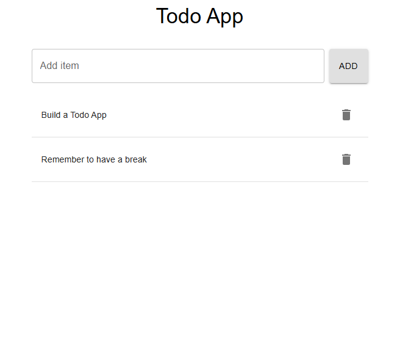

# Todo App

A simple Todo App built following TDD principles using [Express](https://expressjs.com/), [TypeScript](https://www.typescriptlang.org/), and [Material UI](https://mui.com/material-ui/).

---

## Table of Contents

- [Project Purpose](#project-purpose)
- [Current Status](#current-status)
- [Technologies Used](#technologies-used)
- [Testing](#testing)
- [Planned Features](#planned-features)

---

## Project Purpose

This app is being built to:

- Practice Test-Driven Development (TDD)
- Build a RESTful API with Express and TypeScript
- Develop a frontend using Vite + TypeScript + Material UI
- Learn proper error handling and validation patterns
- Publish the app using a production platform (Vercel)

---

## Current Status

### Current version looks like this

### Frontend (in progress)

- Initialized with [Vite](https://vitejs.dev/) + [TypeScript](https://www.typescriptlang.org/)
- UI components built with [Material UI](https://mui.com/)
- Functionalities added:
    - Add and Delete todos
    - Displaying todos in a list format
- Tests written with [Vitest](https://vitest.dev/) and [Testing Library](https://testing-library.com/)
    - Unit tests for individual components
    - Integration tests for ensuring proper interaction between components
    - End-to-End tests using [Playwright](https://playwright.dev/)

### Backend

- Basic CRUD operations implemented (GET, ADD, DELETE, PUT)
- Basic error handling (400, 404, 409)
- Unique ID generation with [`uuid`](https://www.npmjs.com/package/uuid)

---

## Technologies Used

### Frontend:

- [Vite](https://vitejs.dev/)
- [TypeScript](https://www.typescriptlang.org/)
- [Material UI](https://mui.com/)
- [Vitest](https://vitest.dev/) + [Testing Library](https://testing-library.com/)
- [Playwright](https://playwright.dev/)
- [ESLint](https://eslint.org/)

### Backend:

- [Node.js](https://nodejs.org/)
- [Express](https://expressjs.com/)
- [TypeScript](https://www.typescriptlang.org/)
- [Jest](https://jestjs.io/) + [Supertest](https://github.com/visionmedia/supertest)
- [uuid](https://www.npmjs.com/package/uuid)
- [ESLint](https://eslint.org/) with TypeScript config

---

### Testing

- **Backend**: Unit, integration and end-to-end tests using [Jest](https://jestjs.io/), [Supertest](https://github.com/visionmedia/supertest) and [Playwright](https://playwright.dev/)
- **Frontend**: Unit and component tests using [Vitest](https://vitest.dev/) and [Testing Library](https://testing-library.com/)
- Continuous Integration is handled via [GitHub Actions](https://docs.github.com/en/actions) to run tests automatically on each push (planned)

---

## Planned Features

In future, the following features are planned:

- Filtering todos by 'completed' status
- Sorting by
    - Aphabetical order
    - Manual order (drag-and-drop)
- Ability to manage multiple lists
- User-specific todo lists